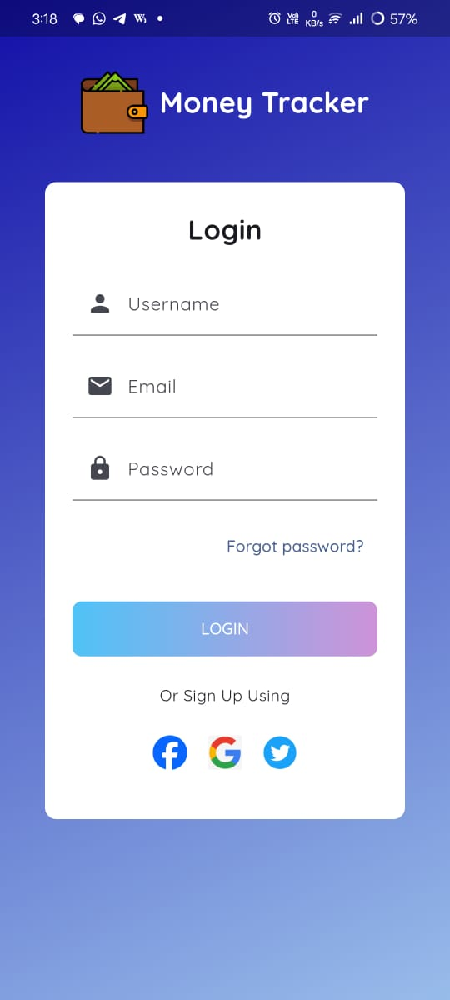
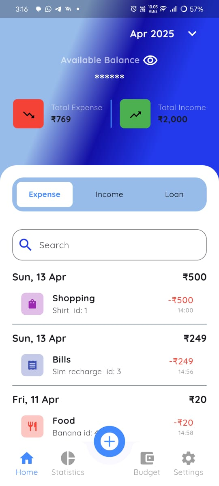
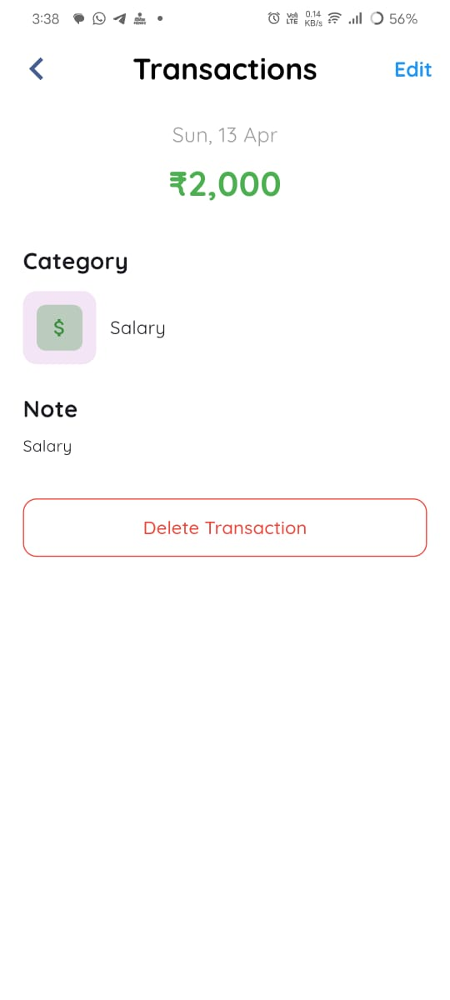
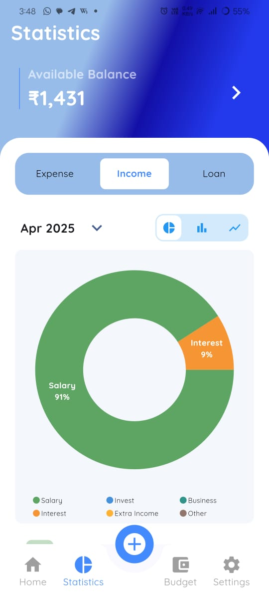
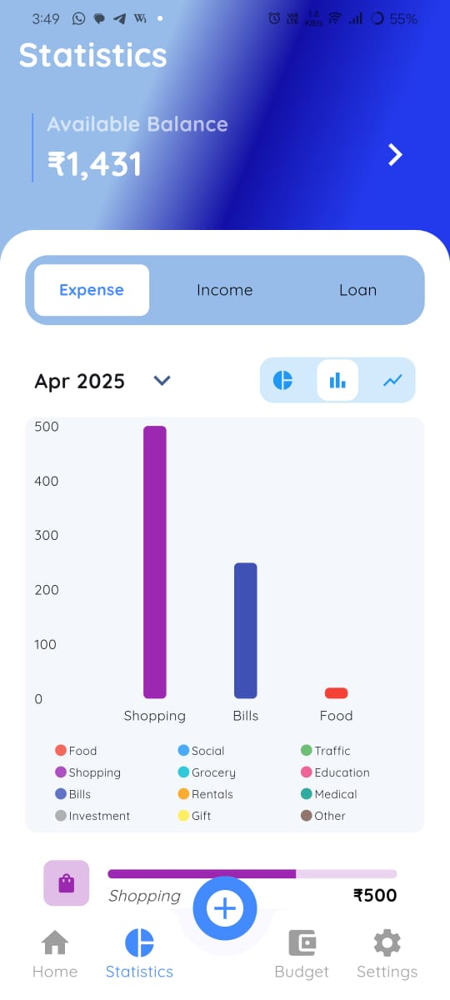
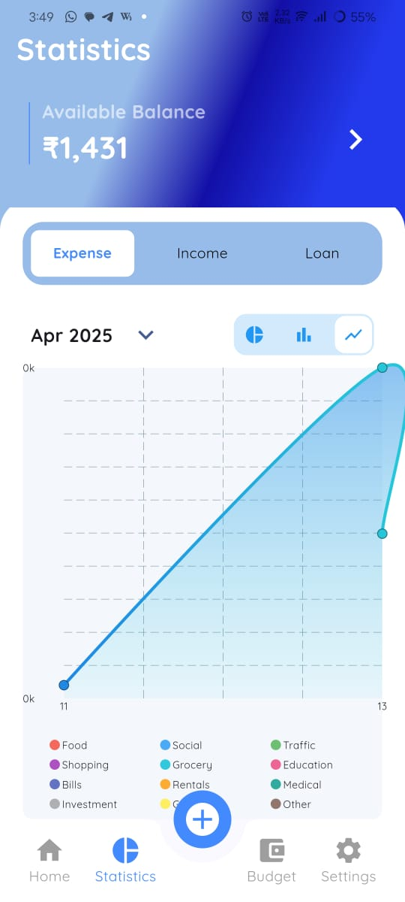
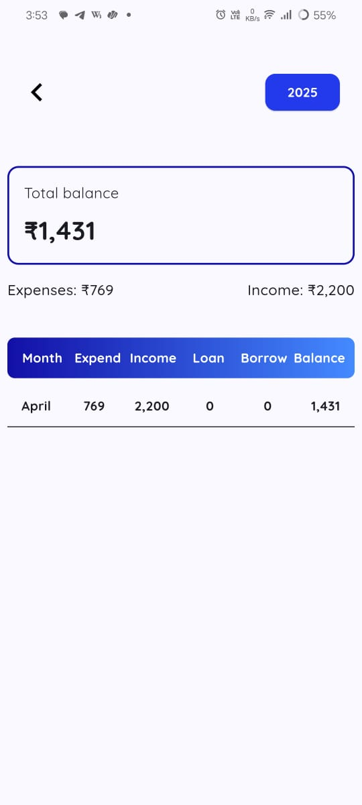
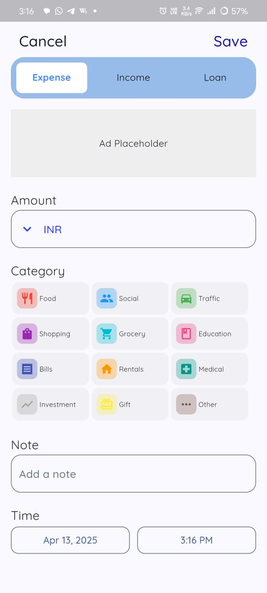
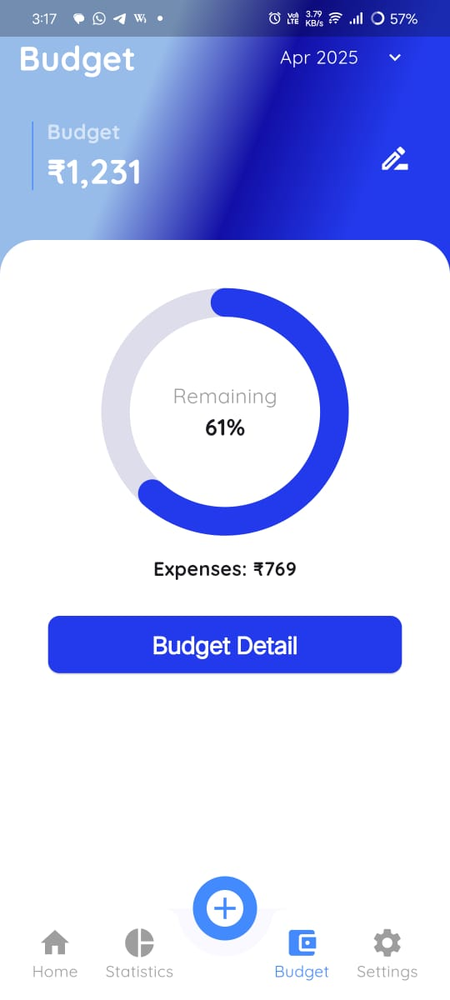
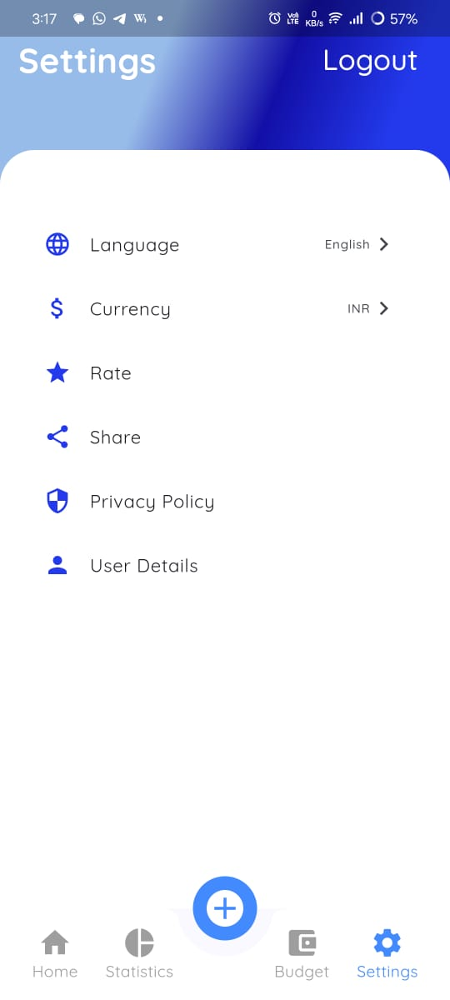

# 💰 Expense Tracker App (Cross-Platform)

A fully functional **Expense Tracker application** developed using **Flutter** with **Supabase backend integration**, designed to work seamlessly across **Android, iOS, Web, and Desktop platforms**.

---
## ❤️ Try App


### 📦 Get APK
[Download here](https://drive.google.com/file/d/1Q2ZWdVrMiPVDHEiJwcjwuP-ret-yHL2G/view?usp=sharing)

### 📦 Get IPA
[Download here](https://drive.google.com/file/d/1CEO1mujsCY02U9njwSFaLF8oTJwdRlQY/view?usp=sharing)

---

## 🧾 MoneyTracker (Personal Finance App)
- Tech Stack: Flutter, Dart, SQLite, fl_chart, SharedPreferences
- A responsive and visually interactive expense tracking app designed to help users manage and analyze personal finances locally.
- A simple and efficient Flutter-based **Money Tracker** app that helps users manage daily expenses, income, loans, and borrowings. 
- The app stores all data locally using SQLite and provides clear visual insights through dynamic charts and summary tables. 
- Daily notifications remind you of your spending activity, keeping your financial habits in check.

---

## ✨ Features

- ✅ Add, edit, and delete transactions (expense, income, loan, borrow)
- 📅 Filter transactions by date and category
- 📊 Pie, bar and line charts for visual financial analysis
- 📈 Monthly balance table with income, expense, loan, borrow, and balance
- 🔍 Real-time search and category filter
- 🔔 Daily notification of min and max expenses using WorkManager
- 📦 Offline storage using SQLite (no internet required)
- 🎨 Clean, minimal UI with responsive layout

---

## 🛠 Tech Stack

| Technology | Purpose |
|-----------|---------|
| **Flutter** | Cross-platform UI development |
| **Dart** | Programming language |
| **Supabase** | Backend-as-a-Service (Authentication + Database) |
| **PostgreSQL** | Cloud database (via Supabase) |
| **WorkManager** | Background task scheduling |
| **flutter_local_notifications** | Local notifications |
| **fl_chart** | Pie & Bar charts |
| **Provider / setState** | State management |

---

## 📸 Screenshots

|                                                 |                                                |                                                 |                                              |
|:-----------------------------------------------:|:----------------------------------------------:|:-----------------------------------------------:|:--------------------------------------------:|
|          |                |                  |  |
|  |  |  |    | 
|          |               |         |           |

---

## 🔗 Supabase Integration

The project uses **Supabase** as the backend for:
- User authentication
- Secure session management
- Cloud database operations
- Cross-platform data synchronization

✅ Supabase integration is **fully completed** and **works on all platforms**.

---

### 1️⃣ Supabase Setup
1. Go to https://supabase.com
2. Create a new project
3. Copy the **Project URL** and **Anon Public Key**

---

### 2️⃣ Flutter Configuration

Initialize Supabase in `main.dart`:

```dart
await Supabase.initialize(
  url: 'YOUR_SUPABASE_URL',
  anonKey: 'YOUR_SUPABASE_ANON_KEY',
);
```

---

### 3️⃣ Database Schema

| Table | Description |
|------|-------------|
| **profiles** | Stores user profile information |
| **categories** | Income and expense categories |
| **transactions** | User financial transactions |

- Uses **UUID / INT IDs** as per Supabase standards
- Flutter models are aligned with backend data types

---

### 4️⃣ Authentication Flow
- Email & Password authentication using Supabase Auth
- Session persistence across app restarts
- Auto-login if session exists
- Secure logout with proper navigation handling

---

## 🌍 Platform Support

| Platform | Status |
|---------|--------|
| Android | ✅ Fully Working |
| iOS | ✅ Fully Working |
| Web | ✅ Fully Working |
| Windows / Desktop | ✅ Fully Working |

---

## 🚀 Getting Started

1. Clone the repository
   ```bash
   git clone https://github.com/agharsh53/iPA_generate
   ```
2. Navigate to the project directory
3. Install dependencies
   ```bash
   flutter pub get
   ```
4. Add Supabase credentials
5. Run the application
   ```bash
   flutter run
   ```

---

## 📦 Deliverables
- Android APK
- iOS IPA
- Web build
- Demo videos
- Complete documentation

---

## 📌 Notes
- Legacy local database logic has been removed
- Supabase is used as the primary backend
- The project is structured for scalability and production readiness

---

## 🧪 Project Status
- Feature Complete ✅
- Cross-platform Tested ✅
- Backend Integration Finalized ✅

---

## 📄 License
This project is intended for **educational, internship, and evaluation purposes**.


